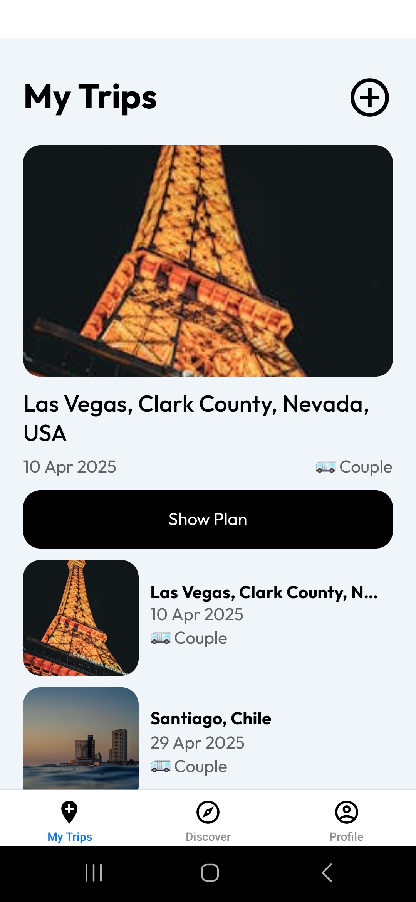
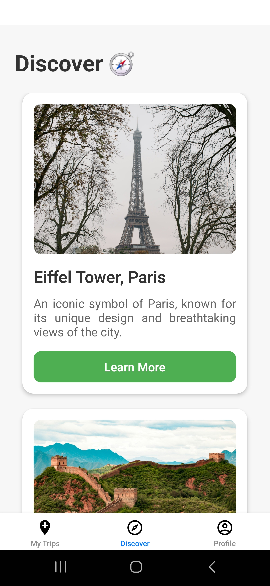
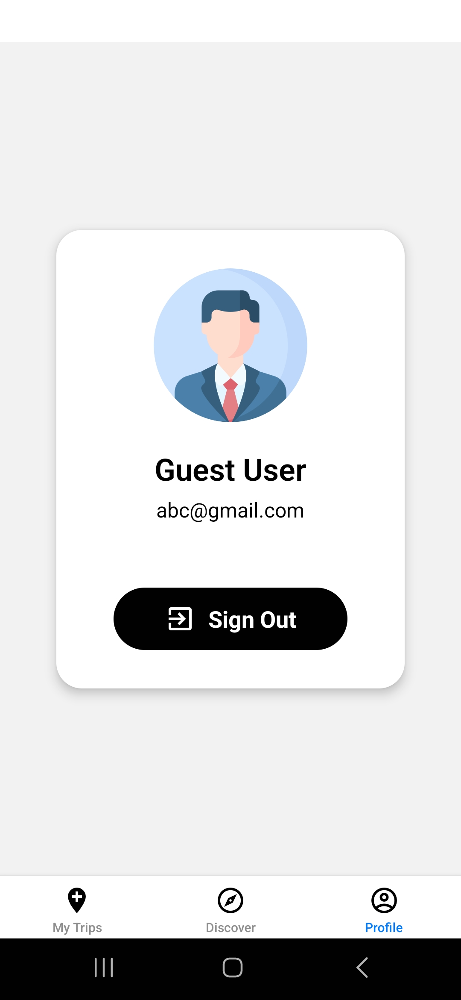
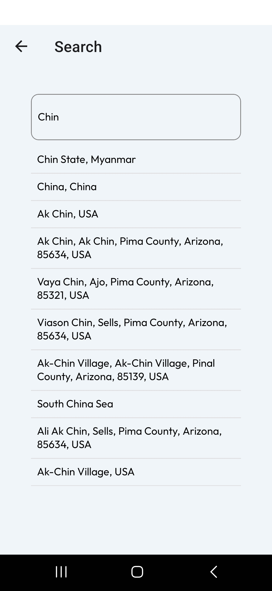
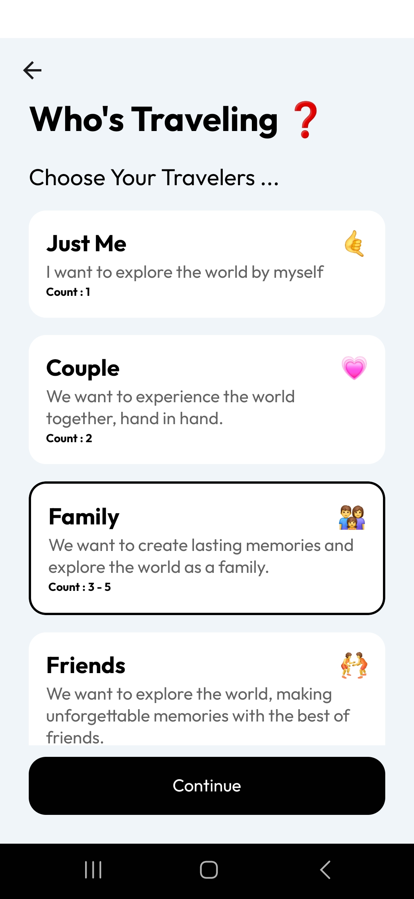
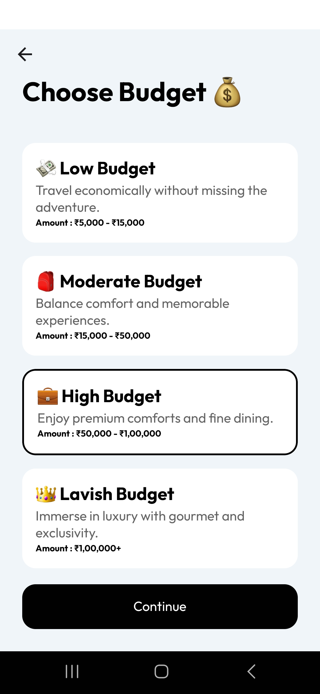
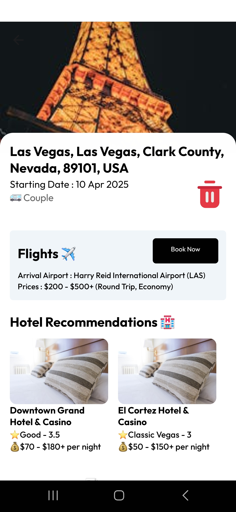
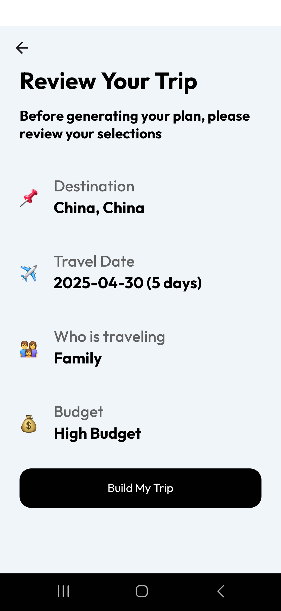
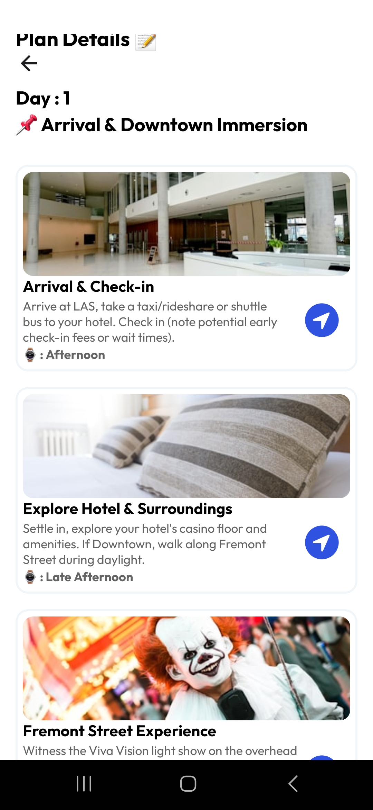

# 🌍✈️ VoyageX – AI Trip Planner App

Welcome to **VoyageX** – the ultimate AI-powered trip planner app designed to help users effortlessly plan their travel adventures. With VoyageX, users can create personalized itineraries based on preferences like **budget**, **travel partners**, **flights**, **hotels**, and more!

---

## 🚀 Features

### ✅ Plan Your Perfect Trip
- **Personalized Preferences:** Tailor your trip based on your **budget**, **travel partners**, and interests.
- **Complete Itinerary:** Generate detailed itineraries including flights, hotels, and activities.

### ✈️ Smart Travel Information
- **Flight & Hotel Details:** Get schedules, costs, and booking info all in one place.
- **Discover Popular Places:** Explore trending destinations on the **Discover** page.

### 💡 User-Friendly Experience
- **Responsive UI:** Works across devices with a smooth user experience.
- **Quick & Easy to Use:** Intuitive interface makes planning simple.

### ☁️ Secure & Cloud-Based
- **Authentication Services:** Your trips are securely stored in the cloud.
- **Cloud Sync:** Access your plans from any device.

---

## 🛠️ Technology Stack

- **Frontend:** React Native (with Expo)
- **Backend/Cloud:** Firebase (for authentication and storage)
- **Design:** Clean and modern UI/UX for a seamless user journey

---

## 🧭 App Workflow

**VoyageX** consists of three main tabs: **Home**, **Discover**, and **Profile**.

### 🏠 Home Tab
- View and manage your planned trips.
- Add a new trip through a step-by-step process:
  1. **Search a Destination** – Enter place name and get smart suggestions.
  2. **Select Travelers** – Choose between Solo, Couple, Family, or Friends.
  3. **Set Budget** – Define your preferred travel budget.
  4. **Pick Dates** – Choose start and end dates.
  5. **Review Trip** – Confirm selections and build your trip itinerary.

### 🔍 Discover Tab
- Browse and get inspired by top destinations.
- View quick travel insights and highlights.

### 👤 Profile Tab
- Manage your account and settings.
- View previous trips and log out.

---

## 📱 VoyageX in Action

<table>
<tr>
<td width="33%">

**🏠 Home Dashboard**

Manage and view all your planned trips

</td>
<td width="33%">

**🔍 Discover Places**

Explore trending destinations worldwide

</td>
<td width="33%">

**👤 User Profile**

Account management and settings

</td>
</tr>
</table>

### 🚀 Smart Trip Planning Process

<details>
<summary><strong>See the complete planning journey</strong></summary>

| Step | Screen | Description |
|:---:|:---:|:---|
| 1️⃣ |  | **Search Destination** - Find your perfect travel spot |
| 2️⃣ |  | **Choose Travelers** - Solo, couple, family, or friends |
| 3️⃣ |  | **Set Budget** - Define your spending comfort zone |
| 4️⃣ |  | **Plan Details** - Customize your itinerary |
| 5️⃣ |  | **Review & Confirm** - Final check |
| 6️⃣ |  | **Detailed Itinerary** - Complete day-by-day plans |

</details>


---

## 💻 Installation & Setup

1. Clone the repository:
   ```bash
   git clone https://github.com/Shubham-Kumar4285/voyagex.git
   cd voyagex
